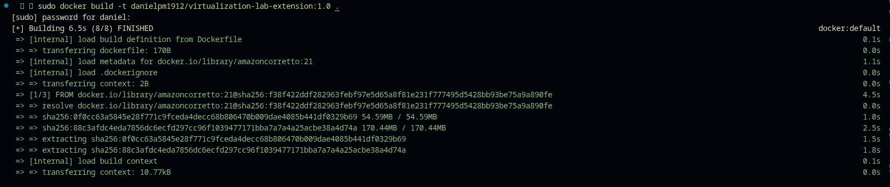

# Web App Framework Extension

Repository 2 of the *Containerizing and Deploying a Java Web Application* workshop (TDSE). It contains a minimal, hand-built Java web framework (no Spring) extended to support **concurrent request handling**, **graceful shutdown**, **environment-based configuration**, **Docker packaging**, and **AWS EC2 deployment**.

## Current state of the framework

The framework is a small set of plain-Java classes built on top of `ServerSocket`:

| Class | Responsibility |
|---|---|
| [`Main`](src/main/java/edu/co/escuelaing/Main.java) | Application entry point: registers routes and starts the server. |
| [`WebFramework`](src/main/java/edu/co/escuelaing/WebFramework.java) | Public API (`get`, `start`, `stop`) exposed to application code; delegates to `Router` and `HttpServer`. |
| [`Router`](src/main/java/edu/co/escuelaing/Router.java) | Maps a path to the `WebService` that handles it. |
| [`WebService`](src/main/java/edu/co/escuelaing/WebService.java) | Functional interface implemented by route handlers (lambdas). |
| [`Request`](src/main/java/edu/co/escuelaing/Request.java) / [`Response`](src/main/java/edu/co/escuelaing/Response.java) | Minimal request query-parameter parsing and response status holder. |
| [`HttpServer`](src/main/java/edu/co/escuelaing/HttpServer.java) | Owns the `ServerSocket`, accepts connections, dispatches them to a thread pool, and builds raw HTTP responses. |

Only `GET` requests are supported, and only two routes are registered by `Main`: `/hello` and `/shutdown`.

## Changes introduced in this extension

Before this extension, `WebFramework.get/start/stop` were empty stubs and `Main` never called `start()`, so the server never actually ran. The following was implemented:

1. **Wired `WebFramework` to the rest of the framework** ([`WebFramework.java`](src/main/java/edu/co/escuelaing/WebFramework.java)): `get()` now registers routes on a `Router`, and `start()`/`stop()` delegate to an `HttpServer` instance. `Main` now calls `webFramework.start()`.
2. **Concurrent request handling** ([`HttpServer.java`](src/main/java/edu/co/escuelaing/HttpServer.java)): each accepted connection used to spawn an unbounded `new Thread(...)`. It's now submitted to a bounded `ExecutorService` (`Executors.newFixedThreadPool`), sized via the `THREAD_POOL_SIZE` environment variable, so the number of concurrent workers is controlled instead of growing without limit under load.
3. **Graceful shutdown**: `running` is now `volatile` for cross-thread visibility, the `ServerSocket` is kept as a field so `stop()` can close it (which unblocks the blocking `accept()` call), and `stop()` shuts the executor down with `awaitTermination` before returning. Previously, calling `stop()` never actually stopped the accept loop.
4. **Environment-based port configuration**: kept from the original code — `PORT` is read from the environment with a default of `8080`.
5. **Fixed the Docker image**: the packaged jar had no `Main-Class` in its manifest, so `java -jar app.jar` failed with `no main manifest attribute`. Added the `maven-jar-plugin` configuration to [`pom.xml`](pom.xml) to set `edu.co.escuelaing.Main` as the entry point.

### Evidence of progress (commits)

| Commit | Description |
|---|---|
| [`0684dd2`](https://github.com/daniel-pm19/containerizing-and-deploying-a-java-web-app-framework-extension/commit/0684dd2ec0611001bb5f0935548df94a84766040) | Introduces the thread pool for concurrent request handling. |
| [`586d688`](https://github.com/daniel-pm19/containerizing-and-deploying-a-java-web-app-framework-extension/commit/586d68897a2d70d83cd4e3f616e0d86a93c891a9) | Completes `WebFramework` wiring to `Router`/`HttpServer`. |
| [`5fe6ff9`](https://github.com/daniel-pm19/containerizing-and-deploying-a-java-web-app-framework-extension/commit/5fe6ff971026097f009a2485956719492512ba0c) | Removes the unused `port` parameter from `HttpServer.start()`. |
| [`8fc838a`](https://github.com/daniel-pm19/containerizing-and-deploying-a-java-web-app-framework-extension/commit/8fc838ab20bafc5cd39b23d7120cc6f52e9bca85) | Adds local, Docker, and AWS EC2 evidence. |

## Environment variables

| Variable | Description | Default |
|---|---|---|
| `PORT` | Port the server listens on. | `8080` |
| `THREAD_POOL_SIZE` | Number of worker threads handling requests concurrently. | `10` |
| `APP_ENV` | When set to `development`, enables the `/shutdown` route; any other value makes it respond `405`. | `production` |

Copy [`.env.example`](.env.example) to `.env` and adjust values for local runs; `.env` is git-ignored.

## Build and run locally

```bash
mvn clean package
java -jar target/*.jar
```

Test it:

```bash
curl "http://localhost:8080/hello?name=World"
```

To override the defaults:

```bash
PORT=9090 THREAD_POOL_SIZE=4 APP_ENV=development java -jar target/*.jar
```

## Run with Docker

```bash
docker build -t danielpm1912/virtualization-lab-extension:1.0 .

docker run -d \
  --name virtualization-lab-extension \
  --env-file .env \
  -p 8080:9000 \
  danielpm1912/virtualization-lab-extension:1.0
```

Docker Hub image: [`danielpm1912/virtualization-lab-extension`](https://hub.docker.com/r/danielpm1912/virtualization-lab-extension)

## AWS EC2 deployment

The image was pulled and run on an Amazon Linux 2023 EC2 instance, with a security group allowing SSH only from the developer's IP and the application port open for testing:

```bash
sudo yum update -y
sudo yum install -y docker
sudo service docker start
sudo usermod -a -G docker ec2-user   # re-login required for this to take effect

docker pull danielpm1912/virtualization-lab-extension:1.0

sudo docker run -d \
  --name virtualization-lab-extension \
  --env-file .env \
  --restart unless-stopped \
  -e PORT=9000 \
  -p 8080:9000 \
  danielpm1912/virtualization-lab-extension:1.0
```

Public deployment URL used during testing: `http://32.198.44.31:8080/hello?name=AWS-Extension` (the EC2 instance is terminated after the workshop to avoid charges, per the assignment instructions — the screenshots below are the evidence of it working).

## Evidence

### Local build, execution, and Docker Hub

| | |
|---|---|
|  | Building the image locally with Docker. |
|  | Image listed locally after the build. |
|  | Container running locally, port `34000` mapped to the container's `9000`. |
|  | `GET /hello?name=Container` answered by the local container. |
|  | Tagging and pushing `1.0` and `latest` to Docker Hub. |

### AWS EC2 deployment

| | |
|---|---|
|  | EC2 security group: SSH restricted to the developer's IP, application port open for the test. |
|  | Running the container on the EC2 instance via SSH (`sudo docker run --env-file .env --restart unless-stopped ...`), confirmed `Up` with `docker ps`. |
|  | `GET /hello` answered from the public EC2 address. |
|  | Two simultaneous requests to `/hello` on EC2, both answered independently — concurrent handling verified on the real deployment. |
|  | `/shutdown` correctly rejected (`405 Not Allowed Operation`) while `APP_ENV` is not `development`. |
|  | A request to `/shutdown` and a concurrent request to `/hello` are both served independently. |
|  | With `APP_ENV=development`, `/shutdown` triggers the graceful shutdown path (`"The server will shutdown after this response"`), while a concurrent `/hello` request still completes. |

